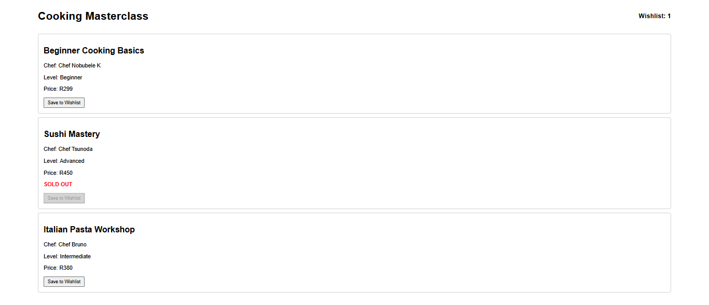

# 🍳 Cooking Masterclass Catalogue

This is a small Vue.js project I built for the Module 1 Frontend Web Development exercise.
The app shows a list of cooking classes. Each class has a title, chef name, level, and price.
You can also see if a class is sold out, and you can save classes to a wishlist.

How to run the project

Install packages:

npm install

Start the development server:

npm run dev

---

## 📸 Screenshot

---

## 🚀 Features

- Course cards shown on the page

- Wishlist feature (the number updates when you save a course)

- Sold out classes show a message

- Responsive layout

- Basic styling

- Components used for structure (Header, Course List, Course Card)

---

## 📁 Project Structure
- src/
  components/
  data/
  App.vue
  main.js

---

